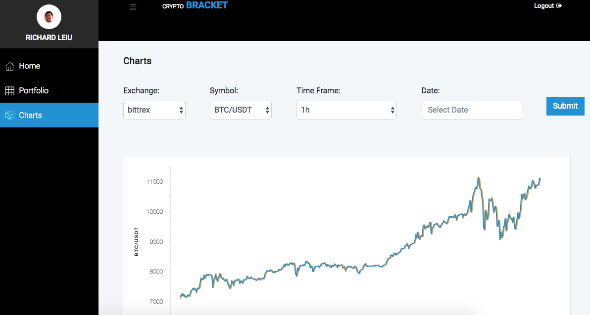
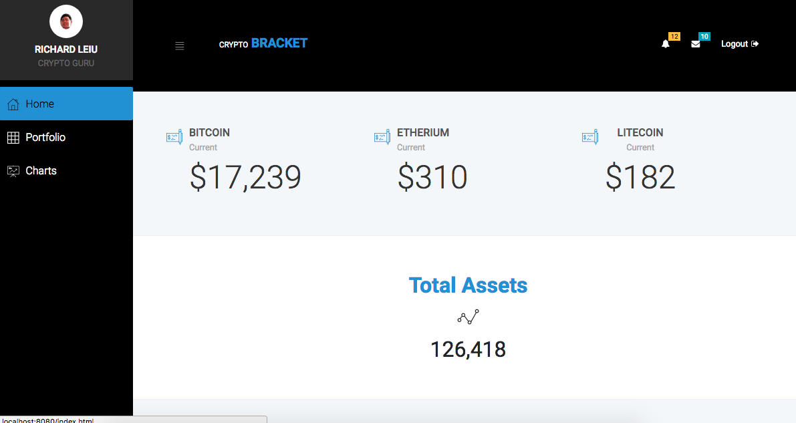
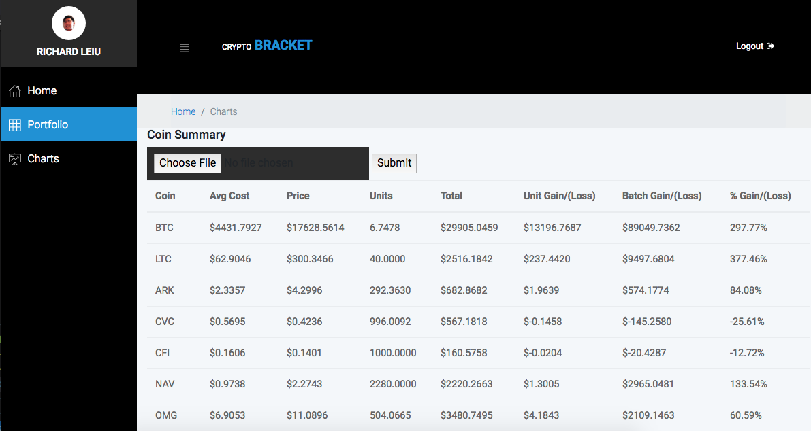
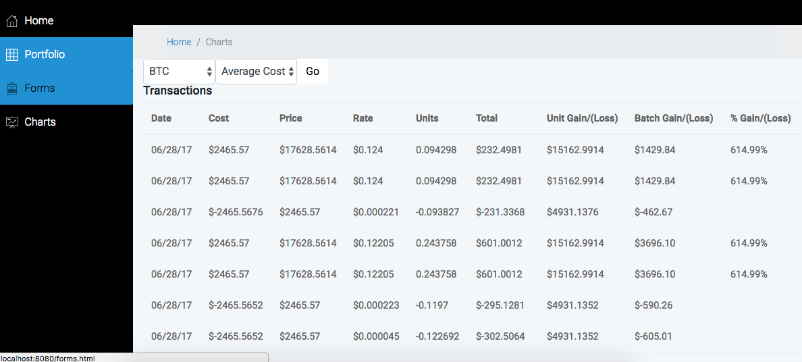
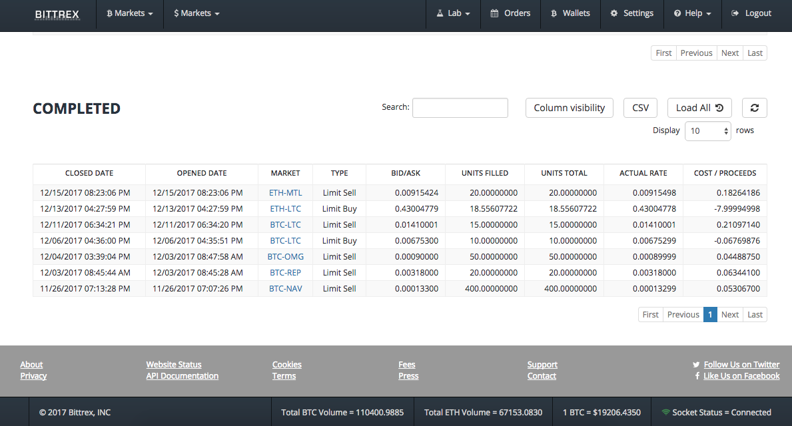

# Crypto Bracket

### About

Crypto Bracket is a tool that allows crypto currency investors to:

- Lookup current and historical coin prices
- View a portfolio dashboard, holdings by coin, and transaction details
- Track realized and unrealized gains and losses and tax basis by transaction

### Live Link

https://crypto-bracket.herokuapp.com/

## Screenshots

### Historical Prices

### Portfolio Dashboard

### Holdings Summary

### Transaction Details

### Upload Transactions

Download your Bittrex orders (see below; Click CSV button on completed orders) and upload the file on the portfolio page.

### Authors

Eric Han (@erichan42), Richard Lieu (@lieu510), Fausto Rendon (@frendon001), and Evan Lu (@evanlu7)
